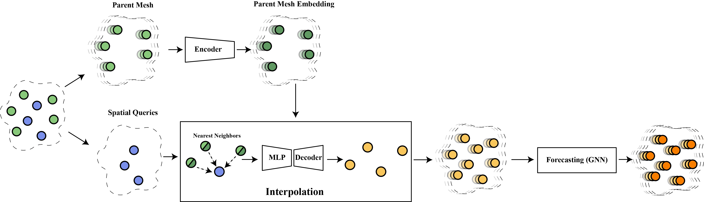
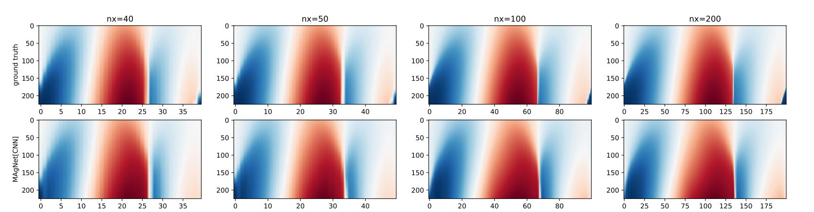

# MAgNet: Mesh-Agnostic Neural PDE Solver
This is the official repository to the paper "MAgNet: Mesh-Agnostic Neural PDE Solver". In this paper, we aim to address the problem of learning solutions to Pratial Differential Equations (PDE) while also generalizing to any mesh or resolution at test-time. This effectively enables us to generate predictions at any point of the PDE domain.  

```
@inproceedings{
boussif2022magnet,
title={{MA}gNet: Mesh Agnostic Neural {PDE} Solver},
author={Oussama Boussif and Yoshua Bengio and Loubna Benabbou and Dan Assouline},
booktitle={ICML 2022 2nd AI for Science Workshop},
year={2022},
url={https://openreview.net/forum?id=tbIJmAdqYc8}
}
```




# Requirements

Start by installing the required modules:
```
pip install -r requirements.txt
```
# Dataset
The dataset is available for download at the following link: [magnet dataset](https://www.dropbox.com/sh/5d8vq03vmw21dhf/AAD1nK5ElGTiQ3dkoGjstthHa?dl=0).

The structure of the dataset is as follows:
```
├───E1
│   ├───irregular
│   │       CE_test_E1_graph_100.h5
│   │       CE_test_E1_graph_200.h5
│   │       CE_test_E1_graph_40.h5
│   │       CE_test_E1_graph_50.h5
│   │       CE_train_E1_graph_30.h5
│   │       CE_train_E1_graph_50.h5
│   │       CE_train_E1_graph_70.h5
│   │       
│   └───regular
│           CE_test_E1_100.h5
│           CE_test_E1_200.h5
│           CE_test_E1_40.h5
│           CE_test_E1_50.h5
│           CE_train_E1_50.h5
│           
├───E2
│   └───regular
│           CE_train_E2_50.h5
│           CE_test_E2_100.h5
│           CE_test_E2_200.h5
│           CE_test_E2_40.h5
│           CE_test_E2_50.h5
│           
└───E3
    └───regular
            CE_test_E3_100.h5
            CE_test_E3_200.h5
            CE_test_E3_40.h5
            CE_test_E3_50.h5
            CE_train_E3_50.h5
```

Each file is formatted as follows: `CE_{mode}_{dataset}_{resolution}.h5` where `mode` can be `train` or `test` and `dataset` can be `E1`, `E2` or `E3` and `resolution` denotes the resolution of the dataset. The folder `regular` contains simulations on a regular grid and `irregular` contains simulations on an irregular grid.
# Experiments
We use `hydra` for config management and command line parsing so it's straightforward to run experiments using our code-base. Below is an example command for training the **MAgNet[CNN]** model on the **E1** dataset for 250 epochs on four GPUs:
```
python run.py \
model=magnet_cnn \
name=nomeshbis \
datamodule=h5_datamodule_implicit \
datamodule.train_path={train_path} \
datamodule.val_path={val_path}' \
datamodule.test_path={test_path} \
datamodule.nt_train=250 \
datamodule.nx_train={train_resolution} \
datamodule.nt_val=250 \
datamodule.nx_val={val_resolution} \
datamodule.nt_test=250 \
datamodule.nx_test={test_resolution} \
datamodule.samples=16 \
model.params.time_slice=25 \
trainer.max_epochs=250 \
trainer.gpus=2 \
trainer.strategy='ddp'
```
We will shortly release all scripts used for running experiments in the paper.
